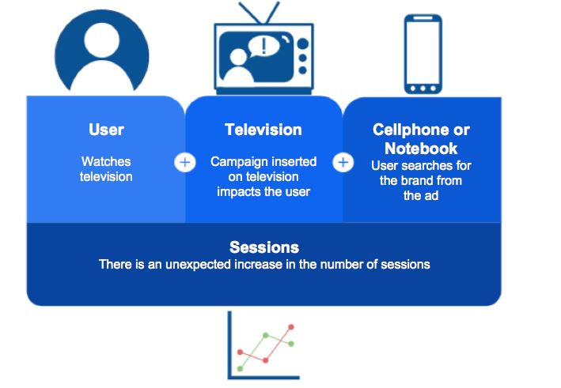
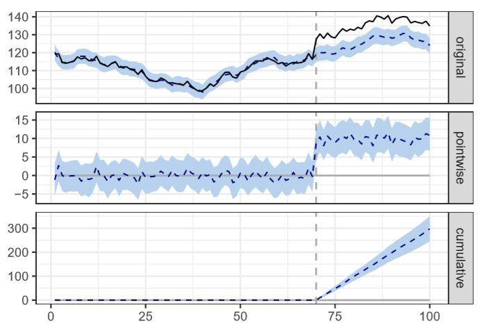

# Offline-Atrribution-Causal-inference-modellig-

Generally speaking, the offline media channels include TV, broadcast, newspaper, coupons and outdoor advertising etc.
Compared to online attribution, it is more difficult to measure the impact of offline marketing interventions

How to evaluate the impact of Offline actions on Online environments

Simple model of contextualization of the Lift calculation

### When a randomised controlled experiment is not possible, an inferential method can assist.
Below we demonstrate one such method for causal inference:

(DevelopedbyGoogle, the CausalImpact )

### Scenario
You run a business that sells widgets. Throughout the year your product demand and website traffic goes up and down based on a variety of seasonal factors. You decide to run a TV commercial to promote your product coming into a busy time of year. This advertisement kicks off on a specified launch date and runs in just one of your markets (not all regions). 

#### How can we measure the impact of this TV advertisement on website traffic? 

Causal Inference Modelling
The solution uses a three step process:
i)  Identify a control group which in that case could be website sessions from another unaffected region
ii) Using historical data from our advertising region, construct a model that predicts what would have happened in our advertising region during the campaign period if no action was taken. This is called the counterfactual
iii) Compare this counterfactural prediction with the actual number of website sessions to calculate the actual uplift attributable to our TV commercial.

### Plot the output:

### outpt result :
i) The ‘original’ facet shows the actual website visits in the black solid line and predicted values without marketing intervention in the blue dashed line. The period of intervention is shown as vertical dashed lines. The confidence intervals is shaded in blue.

ii) The second, ‘pointwise’ graph basically shows the difference between the actual values and the predicted values.

iii) The third, ‘cumulative’ graph shows the summed effect of the marketing intervention after accumulating the differences caused by the marketing activity since the start date of the intervention.

